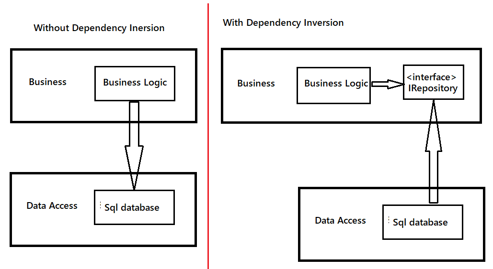
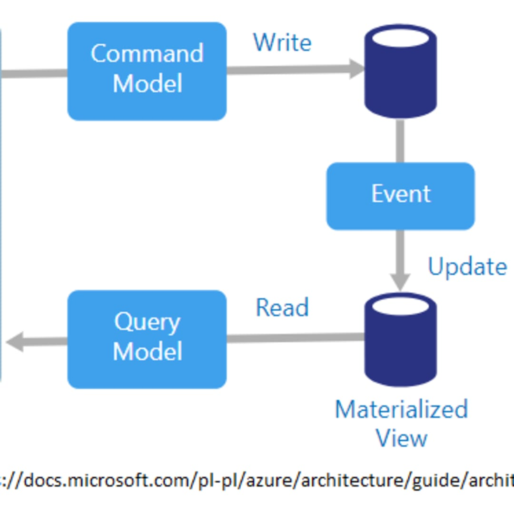

# AspNetMicroservices

AspNetMicroservices

- create blank solution and change solution folder name to 'src'
- create Catalog.API project. disable https, enable Open API

## MongoDB Docker

https://hub.docker.com/_/mongo

- open powershell in solution src folder
- also visualize in docker desktop

  > docker ps

  > docker pull mongo

  - -d >detach mode
  - -p > port
  - docker run -d -p 27017:20717 --name {DB Name} {Image Name}

    > docker run -d -p 27017:20717 --name shopping-mongo mongo

  - shows currently running container eg:shopping-mongo

    > docker ps

  - show stopped containers

    > docker ps -a

  - see list if docker images present

    > docker images

  - for toubleshooting

    > docker logs -f shopping-mongo

  - for getting into mongo interactive terminal for shopping-mongo container
    > docker exec -it shopping-mongo /bin/bash

  > ls

  > mongo

  - show databases

    > show dbs

  - create CatalogDb database

    > use CatalogDb

  - create Products collection (table)
    > db.createCollection('Products')
    > db.Products.insertMany([
    > {
        "Name":"Asus Laptop",
        "Category":"Computers",
        "Summary":"Summary",
        "Description":"Description",
        "ImageFile":"ImageFile",
        "Price":54.93
    },{
    "Name":"Hp Laptop",
    "Category":"Computers",
    "Summary":"Summary",
    "Description":"Description",
    "ImageFile":"ImageFile",
    "Price":84.93
    }
    ])

  > db.Products.find({}).pretty()

  - remove collection (drop table)
    > db.Products.remove({})

  > show databases

  - to see all collections like Products,..
    > show collections

- after running docker container and closed. again running shoes error "the container name '/shopping-mongo' already in use by container".to rerun

  > docker start {container name}

  - docker start a141

  > docker ps

# Catalog API Microservices

- Asp.Net Core web API application
- REST API, CRUD Operations
- MongoDB database connection and contanorization
- repository pattern
- Contanerize Microservices with MongoDB using Docker Compose.

| Method | Request Url                                    | UseCase                         |
| ------ | ---------------------------------------------- | ------------------------------- |
| GET    | api/v1/Catalog                                 | listing products and Categories |
| GET    | api/v1/Catalog/{id}                            | Get product with product Id     |
| GET    | api/v1/Catalog/GetProductByCategory/{category} | Get Products by category        |
| POST   | api/v1/Catalog                                 | Create new product              |
| PUT    | api/v1/Catalog                                 | Update product                  |
| DELETE | api/v1/Catalog/{id}                            | delete product                  |

- use layered architechture

  - Data Access layer
  - Business Login Layer
  - Presentation layer

- package manager console (nuget install) in Catalog-API MS

  > Install-Package MongoDB.Driver

  - update swagger nuget
    > Update-Package -ProjectName catalog.API

### Containerize Catalog Microservice with MongoDB using Docker compose

- Docker compose is a tool that enables application to be defined and run.
- it can define multiple container definitions in single file and run the application by raising all the requirements that the application needs with single command

- right click on catalog.API project>Add> container orchestration support.
- Visual studio creates dockerfile in project and docker compose in solution. docker compose overrides yaml file
- from application will start and runs in docker with play button

- Docker Compose settings in Visual studio>tools>options>docker compose

  - pull required docker images on project open > false
  - pull updated docker images on project open > never
  - remove containers on project close > true
  - run containers on project open > false

- docker-compose.override.yml file can be created different environments
- in docker-compose.yml

  - add mongodb image microservice. (officil name in docker hub 'mongo')
  - add volumes> docker volumes is a datastorage that are outside of containers and exists on the host file system.ie., even if mongo image is removed, docker will save database records,tables inside mongo_data (any name)

- override docker-compose.override.yml with catalogdb,catalog.api containers
- right click dockerCompose project > terminal powershell

  > ls

  > docker ps

  - stop already created containers

    > docker stop {container_id}

  - remove the container

    > docker rm {container_id}

  - show created images

    > docker images

  - remove image
    > docker rmi {image_id}

- docker-compose.yml file pulls the image of mongo & .net api
- docker-compose.override.yml injects configuration for them

  - run docker compose select file and is override. up in decth mode.check docker desktop for new containers
    > docker-compose -f .\docker-compose.yml -f .\docker-compose.override.yml up -d

  > docker ps

  > docker images

Now Open http://localhost:8000/swagger/index.html to access catalog.api running in docker container

### Debugging Docker-Compose

- add containers window in visula studio. view> other windows>containers
- Now Build solution > build docker image using docker-compose commands. and clean solution> runs docker-compose down commands which stop and clean containers from local environment
- before running dockerComponse button> stop all containers in docker compose. in src folder
  > docker-compose -f docker-comppose.yml -f docker-compose.override.yml down
- clicking run dockerComponse button > creates container from docker file image and runs container. this open catalog api swagger which is debuggable.
- launch will be changed automatically for docker or goto properties>debug
- while debugging mongoDb may throw error.this may be due to api application considering appsettings.json. so keep db configs in appsettings.development.json with catalogdb container name not localhost
- clean solution kills all running containers
- to run do build run

or

- to start containers (run)
  > docker-compose -f .\docker-compose.yml -f .\docker-compose.override.yml up -d
- to kill containers (clean solution)

  > docker-compose -f .\docker-compose.yml -f .\docker-compose.override.yml down

- check running containers
  > docker ps
- there will 2 images for catalogApi 1.dev,2.latest
  _ dockerCompose run button uses 'dev' image with appsettings.development.json
  _ manually running docker-compose commands use 'latest' image \* dockerCompose run button release mode also uses 'latest' image

- to get list of containers
  > docker ps -aq
- to stop all images
  > docker stop $(docker ps -aq)
- to remove all the container from computer
  > docker rm $(docker ps -aq)
- to remove all the images from computer
  > docker rmi $(docker images -q)
- to remove all unused images, containers,networks,cache
  > docker system prune
- to run again use docker up command

### get mongo client image for mongodb dashbord

- https://hub.docker.com/r/mongoclient/mongoclient

  > docker pull mongoclient/mongoclient

  directly run below

  > docker run -d -p 3000:3000 mongoclient/mongoclient

- open http://localhost:3000/ , click connect to 27017 port mongodb

# Basket API Microservices

- create Asp.NetWebApi project(.net5, without https,with swagger openapi)
- change launch settings (properties>debug) from iis to project. change AppUrl port from 5000 to 5001. for docker port is 8001

### Redis:

- Opensourse No SQL Database
- Remote Dictonary Server
- Key-value pairs
- Data Structure server: can store high level data stuctures
- Extremely Fast because it works synchronously
- Save data both on RAM and disk according to configuration

* has features like: shrading, clusturing, sentinal, replication
* disadvantages:

  - doesn't work asynchronously, so performance hit
  - need RAM according to data size
  - doesn't support complex queries like relational databases
  - if a transation receives an error, there is no return

* in this API we store, basket and basket items data in Redis cache system as JSON object.

* in docker compose projects> right click terminal> in src folder

  - install redis docker image https://hub.docker.com/_/redis
    > docker pull redis

  > docker images

  > docker run -d -p 6379:6379 --name aspnetrun-redis redis

* check running containers
  > docker ps

#### for troubleshooting

- check image logs
  > docker logs -f aspnetrun-redis

* for redis interactive terminal (/bin/bash is to open bash script in interactive terminal)

  > docker exec -it aspnetrun-redis /bin/bash

  > redis-cli

  - ping gives response PONG. so redis server is working

    > ping

  * set {keyName} {value}
    > set key value

  - to return "value"
    > get key

### Basket API

| Method | Request URI        | Use Case                                              |
| ------ | ------------------ | ----------------------------------------------------- |
| GET    | api/v1/Basket      | Get Basket and items with username                    |
| POST   | api/v1/Basket      | Update basket and items (add - remove item on basket) |
| DELETE | api/v1/Basket/{id} | delete basket                                         |
| POST   | api/v1/Basket      | checkout basket                                       |

### Basket N layerd Architecture

- Data access layer
- Business logic layer
- Presentaion layer

### why Redis for Basket.API ?

- this api stores and manage baskets and basket item data in their own operations. it is best fit for caching this info.
- for Distributed Cache> its a cache shared by multiple app servers and typically maintained as external service to app servers that access it. eg: Redis cache is in basket.API microservice, all other microservices can reach this for distributed cahing

* Distributed Cache> improves performance, increase scalability especially when app is hosted by cloud service or server farm. ie, it can be served in docker desktop and can be shifted to kubernetes.

* Distributed Cache> used for storing individual application and when cache data is sorting to distributed, the data could be consisted across request from multiple services.

* nuget install

  > Install-Package Microsoft.Extensions.Caching.StackExchangeRedis

  > Update-package -ProjectName Basket.API

* CRUD basket.API from redis.

### Add Docker using visual studio container orchestration support

- Basket.API> right click> add> container orchestration support>Docker compose>Linux
  - this creates docker file in Basket.API project and updates docker-compose.yml file in solution

* override docker-compose yaml file
* before running , remove existing redis image used in development as it also exposes on same port 6379, it cause port conflict error.

> docker ps

> docker stop {redis_containerId}

> docker ps -a

> docker rm {redis_containerId}

- redis image completed removed
  > docker ps -a

* run
  > docker-compose -f docker-compose.yml -f docker-compose.override.yml up -d
  - http://localhost:8001/swagger/index.html

# Portainer

- open source
- manages container based applications
- Kubernetes, Docker, Docker swarm, Azure ACI and edge environments
- manages environments, deploy applications, monitor app performance and triage problems

* less code, easy management and visualize docker components in dashboard
* https://portainer.readthedocs.io/en/master/deployment.html
* portainer management dashboard> https://hub.docker.com/r/portainer/portainer-ce
* add poratiner in docker-compose.yml and its override. then run docker up
  > docker ps
* open http://localhost:9000/#!/init/admin and create user ("admin"|"admin1234")and login >select docker

# Discount.API Microservice

- create Asp .Net Core Web API and set port to 5002

* setup Postgres DB in docker environment
  - https://hub.docker.com/_/postgres official image
  * add postgres in docker-compose yaml and its override file
  * get pgAdmin management tool https://hub.docker.com/r/dpage/pgadmin4 image. pull this image to docker compose and change dockerCompose files and up
    - open http://localhost:5050/ > 'admin@aspnetrun.com|admin1234'
    * addNewserver>
      - general> name:DiscountServer
      - connection> name :discountdb, username:admin, password:admin1234
      * this details match with discountdb in docker-compose.override.yml
      * pgadmin>tools>Query tool>
        CREATE TABLE Coupon(
        ID SERIAL PRIMARY KEY NOT NULL,
        ProductName VARCHAR(24) NOT NULL,
        Description TEXT,
        Amount INT
        ); INSERT INTO Coupon (Productname,description,amount) VALUES('IPhone X','IPhone Discount',150);INSERT INTO Coupon (Productname,description,amount) VALUES('Samsung 10','Samsung Discount',100); SELECT \* FROM public.coupon ORDER BY id ASC
  * do Discount.API crud repository pattern and test
* create docker file in Discount.API and modify docker-compose.yml and its override
* do initial migration of postgres in Program.cs file with retry logic.
* check retry logic by stopping postgreddb and starting

  > docker stop {postgreddb_containerId}

  > docker start {postgreddb_containerId}

* docker up

# Discount.GRPC

### gRPC

- Synchronous backend microservice-to-microservice communication
- Polyglot environments
- Low latency and high throughput communication.
- Point-to-point real-time communication
- Network constrained environments.

### gRPC example

- Create Asp .Net Core gRPC Service Project

* proto file properties has
  - Build action: 'Protobuf Compiler' >This will convert protobuf file to C# classes for client applications.
  - gRPC Subclasses>
    - server Only> ie, it will expose gRPC service to external system
    - Client Only> just consume
    * this property changes in .csproj
    * kestral configured to HTTP2 in appsettings.json
    * once project built , it .proto file will generate .cs classes in obj folder
* copy everything from Discount.API to Discount.Grpc as Discount.API(just example) will not be used in final architechture.
* gRPC project > Http2, proto file and service classes (API project> Http,controller class)
* Discount CRUD gRPC
* Consume Discount.Grpc from Basket.API

# Consume Discount.Grpc(server) in Basket.API(client)

- right click Basket.API>Add> Connected service> Add reference gRPC>gRPC>select .proto file in Discount.Grpc, Class Type:Client Only

* test this using Basket.API POST call (update basket) using debugger in both projects(updateBasket()|GetDiscount())

* before testing in container to get any new changes to docker

  - 1.remove all existing container & image and recreate or 2.use docker-compose up --build command (better)
    > docker-compose -f .\docker-compose.yml -f .\docker-compose.override.yml up -d --build

  * http://localhost:9000/#!/1/docker/containers
  * http://localhost:8000/swagger/index.html
  * http://localhost:8001/swagger/index.html
  * http://localhost:8002/swagger/index.html
  * http://localhost:5050/login?next=%2F >admin@aspnetrun.com|admin1234, DicountServer,discountdb

* for Discout.Grpc logs, check portainer>Discout.Grpc>logs

* start all

  > docker-compose -f .\docker-compose.yml -f .\docker-compose.override.yml up -d

* stop all
  > docker-compose -f .\docker-compose.yml -f .\docker-compose.override.yml down

# Ordering.API Microservice

- ASP .NET Core Web API application , REST API CRUD, EF Core code-first
- Implementing DDD, CQRS and clean architecture using SOLID principles
- Develop CQRS implementaion on command and queries using MediatR, FluentValidation and AutoMapper packages

* RabbitMQ using MassTransit

| Method | Request URI  | Use Case                 |
| ------ | ------------ | ------------------------ |
| GET    | api/v1/Order | Get Orders with username |

- Get orders with username
- Consume basketCheckout event from RabbitMQ
- CQRS implementation with triggering OrderCommand to insert Order record

## SOLID Principles

- S (Single Responsibility)> A class should have only one responsiblity.
- O (Open Close)> A Software module (class or method) should be open for extension but closed for modification
- L (Liskov Substitution)> Objects in a program should be replacable with instances of their subtypes without altering the correctness of the program. Ie, use subclasses instead of upper classes from which they derive without needing to make any changes in code. use interfaces which can be changed by any implementaion.
- I (Interface Segregation)> Clients should not be forced to depend on intefaces that they do not use. ie, instead of collecting all responsibilites into a single interface, create more customized interfaces.separate interfaces as per responsibilities.easy to manage
- D (Dependency Injection)> Program to inteface, not to implementation. ie, dependencies between classes should be low as possible and especially upper classes should not depend on lower classes

## DIP (Dependency Inversion Principle)

high level modules should not depend on low level modules; both should depend on abstractions. Abstractions should not depend on details. Details should depend upon abstractions.

## Separation of Cencerns (SoC)

a design principle for separating a computer program into distinct sections, such that each section addresses a separate concern.

## Domain Driven Design (DDD) - Eric Evans

1. Ubiqutios Language: one of the corner stones of DDD. We need to produce desired output of software developers and ensure continuty of these output, to be able to speak same language(must) as domain experts.Afterwards we must transfer this expertise to methods and classes that we use while developing applications by using names of the concepts used by domain experts. so, every service in the project must have response in the domain. so everyone in the project can speak common language and understand each other.

2. Entity Value Objects:Any object that is collectively defined by all of it attributes is a value object. If any of the attributes change you have a new instance of a value object. This is why value objects are defined as immutable.
   If the object is not fully defined by all of its attributes then there are a subset of attributes that make up the identity of the object. The remaining attributes can change without redefining the object. This kind of object cannot be defined at immutable.A simpler way of making the distinction is to think of value objects as static data that will never change and entities as data that evolves in your application.

- Value Object: When people exchange dollar bills, they generally do not distinguish between each unique bill; they only are concerned about the face value of the dollar bill. In this context, dollar bills are Value Objects. However, the Federal Reserve may be concerned about each unique bill; in this context each bill would be an entity.

- Entity: Most airlines distinguish each seat uniquely on every flight. Each seat is an entity in this context. However, Southwest Airlines, EasyJet and Ryanair do not distinguish between every seat; all seats are the same. In this context, a seat is actually a Value Object.

3. Aggregate root: An AGGREGATE is a cluster of associated objects that we treat as a unit for the purpose of data changes. Each AGGREGATE has a root and a boundary. The boundary defines what is inside the AGGREGATE. The root is a single, specific ENTITY contained in the AGGREGATE.
   The root is the only member of the AGGREGATE that outside objects are allowed to hold references to.

4. Bounded context: recommanded for complex systems which may conatain subdomains within a domain. ex: eCommerce application> Bounded context should be Order Management, Customer management, Stock management, delivery management, Payment System management,Product management, User management,.. many subdomains. these sudomains are grouped. Bounded context refers to stucture in which group of individuals most logically associated with each other in terms of rules of the aggregate root and group toogether and responsibility of the group are clearly defined. Ie, when we combine subdomains, it will reach bounded context and we should group this bounded context with responsibilities clearly defined

## Clean Architecture (Onion Architecture,Hexagonal Architecture)

- Ports and adaptors pattern

1. Framework independence: architecture is decoupled from 3rd party frameworks.
2. Testability: architecture is easy to write unit tests
3. UI independance: architecture can be unplugged from UI
4. Database independance: architecture is decoupled from underlying datastore, databases
5. External agency independance: Business rules of the architecture are isolated and know nothing about outside world

- Domain principle is a depencdency rule.like DIP, source code dependencies should only points inwards(inner arrows in concentric circles).

* inner circle cannot know anything about outer circle.only implemtations of those abstractions will become external outer layers.
* Core and Periphery layer follow DIP. ie, inside layers work with abstractions.actual implementaion lies in outside layer
* Application layer works on interfaces and business logic.interfaces implemented in outside layer.

## CQRS (Command Query Responsility Segregation) Design pattern

- separation of commands and query responsibility

* idea is to separate interfaces between the operations that read the data and operations that update the data. separation of business models
* commands - command handlers
* query - query handlers
  

## Eventual Consistent

- all models in consistent systems are stored consistently without interruption but in eventual consistent systems, the models amy be inconsistent ofr a while as a result of writing and updating processes. This situation is finally resolved and system id eventually be consistent.

* Inconsistant for a while
* this syatem is developed using CQRS pattern. The write and update requests from the client are trasmitted to existing services on the system with write model. If the request is processed, the necessary changes are made to reading model. When the user queries the data, the services answer the request with reading model. CQRS is the updating of reading model with asynchronous processes after the writing model is registered. in CQRS 2 databses are separated by RabbitMQ asynchronous process.so eventually consistent data
* Systems developed with CQRS design patterns are eventual consistent systems.
* in CQRS reading and writing operations do not wait for each other.therefore CQRS is performant
* Asynchronous process
* No transactional dependency

## Event Sourcing

https://medium.com/aspnetrun/cqrs-and-event-sourcing-in-event-driven-architecture-of-ordering-microservices-fb67dc44da7a

  

- Accumulating Events
- Assets are not recorded
- Events recording
- generating state from events

* event sourcing is a method that shaped on idea of accumulating events that took place in the system. Objects that have an identity are called entities.In this system, the latest status of the assets are not recorded instead events affecting the state of the assets are recorded. ie, we store events not assets.
* when the query is sent by client and final status of asset is requested, the system combines the existing event information and provides client with necessary information.
* we can perform eventual consistent through this systems

## CQRS and Event Sourcing

  

# ordering.API

CQRS and DDD

- Core Layers

  - Ordering.Domain layer
  - Ordering.Application layer

- Periphery layers
  - Ordering.API layer
  - Ordering.Infrastructure layer

* Application layer dependa on domain layer
* https://github.com/jasontaylordev/CleanArchitecture
* https://www.pluralsight.com/courses/microservices-communication-asp-dot-net-core

## Mediator Design Pattern

## MediatR Nuget package, Pipeline lifecycle

## MediatR Pipeline behavior

validation pipeline behaviour using Fluent Validation Nuget

## CQRS

## EFCore Migration

- add migration in Ordering.Infrastructure project
  > Add-Migration InitialCreate

* this creates migration classes folder
* when you run all docker-compose file, the containers should create their own databases and their own data for it to work.so, on app startup migrate SQL Server database (create Order DB, create order table with few records). do this migration in program.cs

## SQL Server Doker

https://hub.docker.com/_/microsoft-mssql-server

- write orderdb image & configuration in docker-compose and run docker up

> docker-compose -f .\docker-compose.yml -f .\docker-compose.override.yml up -d

> docker ps

- Note: if the migration throws error "Login failed for user 'sa'" then this may be due to server name. use '[::1]' instead of 'localhost'

* If localhost doesn’t work, try use [::1] in the server name. In WSL2, port 1433 is using IP/TCPv6, SSMS some times is not able to resolve localhost to loopback IP [::1].
